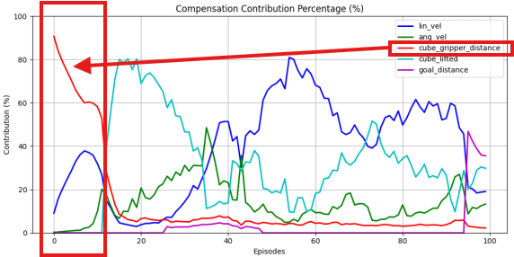
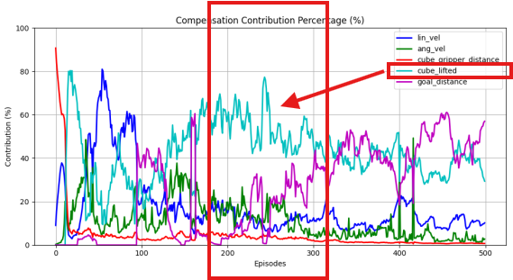
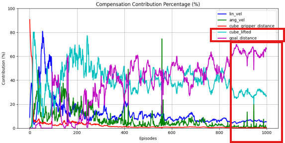
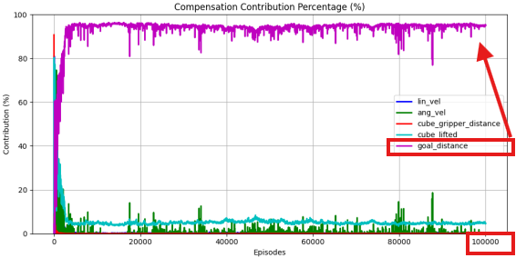

# Isaac Lab(Gym) Quadcopter Object Manipulation

### A deep reinforcement learning framework for training quadcopters to perform object manipulation tasks in Isaac Sim.  
  
  
  

## Introduction  
**IsaacLab Quadcopter Manipulation** is a reinforcement learning framework designed to train drone-based robots to manipulate objects. The quadcopters are trained to identify, approach, grasp, and transport objects to designated locations, performing complex sequential tasks.

Built on IsaacSim, this environment provides realistic physics-based drone-object interactions and supports over 128 parallel environments for scalable distributed training.

## Key Features  
- **Multi-Stage Task Learning**: Trains drones in sequential steps—approaching, grasping, transporting, and placing objects  
- **High-Fidelity Physics Simulation**: Built on IsaacSim for precision physical interactions  
- **Multi-Reward System**: Fine-grained reward signals for velocity control, object approach, grasping, and task completion  
- **Detailed Analytics Tools**: Built-in visualization for tracking and analyzing reward contributions  
- **Massive Parallel Training**: Run hundreds of environments simultaneously to accelerate training  
- **Gripper Control Mechanism**: Precision control for stable grasping and object handling  

## Applications  
This framework can be used for:

- **Object Relocation Tasks**: Moving objects across surfaces like tables  
- **Drone Precision Control**: Stable hovering and flight in various conditions  
- **Drone-Object Interaction**: Performing airborne grasping and manipulation tasks   

## Environment Configuration  
- **Observation Space**: Includes robot states (linear/angular velocity, gravity vector), target position, gripper-object relation  
- **Action Space**: Thrust control, moment control, and gripper joint control (7 dimensions)  
- **Reward Components**:  
  - Velocity penalties to encourage stable flight  
  - Gripper-object distance for accurate targeting  
  - Object lift reward to promote successful grasp  
  - Target distance reward for task completion  

## Reward Design and Analysis  
For complex manipulation tasks, effective reward design is critical. The relative ratio between reward components is more important than their absolute values, as a balanced structure is key to guiding the agent's learning process.  

Our design philosophy follows two core principles:  

- **Sequential Guidance**: The reward system guides the agent through a sequence of sub-tasks (e.g., approach -> lift -> move to goal). Rewards for later stages become more dominant as the agent gains proficiency in earlier ones.  
- **Conditional Gating**: Rewards for later sub-tasks are gated by the successful completion of earlier ones. For example, the goal_distance reward is only active after the cube_lifted condition is true, enforcing the correct sequence.  

### Reward Contribution Over Time  
The following graphs show how the reward composition shifts, validating our design.  

1. **Episode 0-10: Learning to Approach** / **key reward:** `cube_gripper_distance`
  
  <br>
  
2. **Episode 150-300: Mastering the Lift** / **key reward:** `cube_lifted`
  
  <br>
  
3. **Episode 400 - : Focusing on the Goal** / **key reward:** `goal_distance`
  
  <br>
  <br>

## Customization  
The framework allows various customizations:

- Adjust reward components and weights  
- Modify observation space to tune task difficulty  
- Change environment setup (table/object/target positions)  
- Configure robot properties (thrust, gripper behavior)  

## Requirements  
- IsaacLab(v2.0) / IsaacSim(v4.5)  
- PyTorch  
- CUDA-enabled GPU (RTX 3090 GPU recommended)  
- Python 3.8+

## Installation
1. Copy from
  ```
  source\isaaclab_assets\isaaclab_assets\robots\quadcopter.py
  ```
2. Paste within your IsaacLab's folder to
  ```
  IsaacLab\source\isaaclab\assets\robots\
  ```
3. Copy from
  ```
  source\isaaclab_tasks\isaaclab_tasks\direct\quadcopter\quadcopter_env.py
  ```
4. Paste within your IsaacLab's folder to
  ```
  IsaacLab\source\isaaclab_tasks\isaaclab_tasks\direct\quadcopter\
  ```

## Training
```
python scripts/reinforcement_learning/skrl/train.py --task Isaac-Quadcopter-Direct-v0 --num_envs 128 --max_iterations 6300
```

## Playing
```
python scripts/reinforcement_learning/skrl/play.py --task Isaac-Quadcopter-Direct-v0 --checkpoint /home/dmsai3/IsaacLab/logs/skrl/quadcopter_direct/2025-06-25_19-05-18_ppo_torch_29s_100000/checkpoints/best_agent.pt --num_envs 1
```
